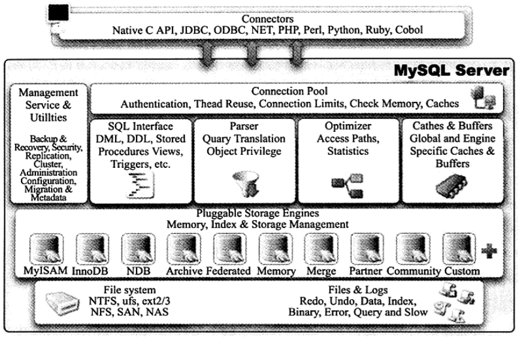
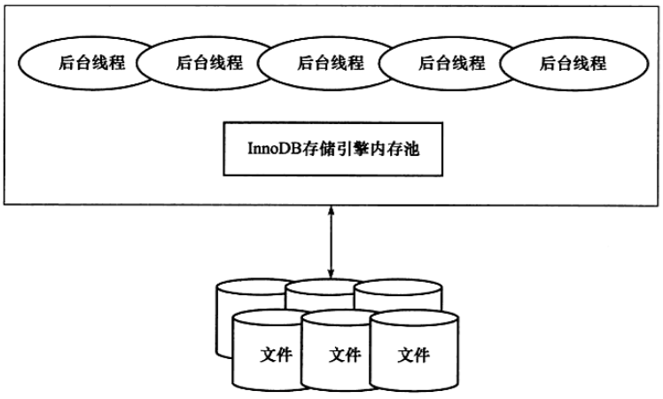
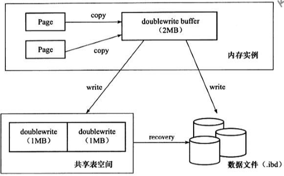
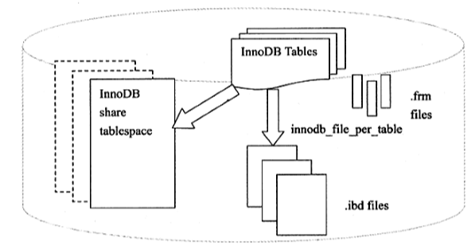

Mysql

## 存储引擎

    插件式存储引擎, 存储引擎是基于表的       
### -- InnoDB   
        特点:
            1. 支持事务, 设计目标注意面向在线事务处理(OLTP)
            2. [行锁设计, 支持外键, 非锁定读, ]
            3. 表单独存放在 .ibd文件中, 由InnoDB引擎管理
            4. 只用用row disk来建立表空间
            5. 通过多版本并发控制(MVCC)来获得高并发, 并且实现SQL4个隔离等级(默认为Repeatable)
            6. 用next-key locking的策略来避免幻读(phantom)
            7. 提供[插入缓冲(insert buffer), 二次写(double write), 自适应哈希索引(adaptive hash index), 预读(read ahead),...]来提高性能的功能
            8. 用聚集(clustered)的方式存储表中数据(表的存储按照主键顺序存放, 没有定义主键时会自动为每一行生成6-byte row-id作为主键)
        疑问:
            InooDB支持全文索引
### -- MyISAM
        特点:
            1. 不支持事务, 表锁设计
            2. 支持全文索引(主要面向OLAP业务, 就是数据查询和分析)
            3. 缓冲池只缓存索引文件, 而不是数据文件
            4. 由[.MYD(data), .MYI(index)]组成
            5. 用myisampack可以压缩.MYD文件(40%~70%原大小), myisampack是用赫夫曼(Huffman)编码静态算法来压缩的, 被压缩的表是只读
            6. 数据文件缓存由操作系统本身完成
### -- NDB
        特点: 
            1. 集群存储引擎, share nothing的集群结构, 所以提供更高的可用性
            2. 数据都是放在内存当中, 所以主键查找(primary key lookups)速度极快, 可以添加NDB数据储存节点(Data Node)
            3. JOIN操作是在Mysql数据库层完成的, 不是在存储引擎完成的, 复杂的JOIN操作需要巨大的网络开销, 因此查询很慢, 如果解决网络开销NDB的市场会非常大
    
### -- Memory
        特点:
            
### -- Maria
        特点:
            1. 替代MyISAM的, 支持缓存数据和索引文件, 
            2. 加入行锁设计, 提供MVCC功能, 支持事务和非事务安全选项, 
            3. 更好的BLOB字符类型处理性能

### -- 存储引擎比较:

## Mysql
    Database => 一堆数据文件 [.frm, .MYD, .MYI, .ibd]
    Instance => 后台线程 + 共享内存区域, 用于操作数据库文件
    特点: 1进程, n线程

### Running Process:
        1. Start Mysql
        2. Read my.cnf (Use compile default if my.cnf not found)
        mysql --help | grep my.cnf
        my.cnf reading preference : [/etc/my.cnf, /etc/mysql/my.cnf, /usr/local/mysql/etc/my.cnf]

### Connections:
        Connection的本质是进程通信
        Mysql connection的通信方式
            1. TCP/IP
            2. Named-pipe & Shared-memory
            3. UNIX DOMAIN SOCKET
    
### Structure:  
           
        *Caches & Buffers 拼错了

        connectors => [Python, PHP, ... (APIs)]
        
        connection pool => [Authentication, Thead Reuse, Connection Limits, Check Memory, Caches]

        Management Service & Utilities => [Backup & Recovery, Security, Replication, Cluster, Administration Configuration, Migration & Metadata]

        mysql functions => [
            SQL Interface => [DML, DDL, Stored Procedures Views, Triggers, ...]
            Parser => [Query Translation, Object Privilege]
            Optimizer => [Access Paths, Statics]
            Caches & Buffers => [Global and Engine Specific Caches & Buffers]
        ]
        
        Pluggable Storage Engines, Memory, Index & Storage Management => [MyISAM, InnoDB, NDB, Custom, ... ]

        File System => [NTFS, ufs, ext2/3, NFS, SAN, NAS]

        Files & Logs => [Redo, Undo, Data, Index, Binary, Error, Query and Slow]

## InnoDB
### 特点:
        1. 完整支持ACID事务
        2. 行锁设计
        3. 支持MVCC, 外键, 一致性非锁定读
        4. 高效利用内存和CPU
        5. 大量使用Async IO处理写IO请求
        6. 硬盘储存, 用页的方式储存
        
### 架构:
           

        1. 管理多个内存块组成的内存池, 负责:
            a. 维护所有进程/线程需要访问的多个内部数据结构
            b. 缓存磁盘上的数据, 方便快速读取, 并在对磁盘文件的数据修改前在内存中缓存
            c. redo log的缓冲
            ...
            F. 后台线程主要的作用是负责
                a. 刷新缓存池的数据, 保证缓存中数据最新
                b. 将已修改的数据文件刷新到磁盘文件
                c. 保证数据库发生异常的情况下InnoDB能恢复正常运行
            
####        后台线程:
#####           Master Thread
                    purpose: 
                        1. 负责缓冲池中的数据异步刷新到磁盘
                        2. 保证数据一致性, [脏页的刷新, 脏页合并, 插入缓冲, undo页收回]
                    how it works:
                        [How Master Thread Works](detail/innodb_master_thread.md)
#####           IO Thread
                    purpose:
                        1. 负责IO请求的回调
                    types:
                        a. write (4个thread, innodb_read_io_threads 参数控制)
                        b. read  (4个thread, innodb_write_io_threads 参数控制)
                        c. insert buffer
                        d. log
                    remark:
                        可以通过 SHOW ENGINE INNODB STATUS\G; 来观察IO threads

#####           Purge Thread
                    purpose:
                        1. 回收事务提交后, 产生的 被分配的 undo页
                    remark:
                        innodb_purge_threads 参数控制

#####           Page Cleaner Thread
                    purpose:
                        1. 处理脏页刷新操作

####        Page(页):
#####           Size:
                    默认大小16kb

####        内存
#####           缓存池(innodb_buffer_pool)
                    purpose:
                        1. 将页 Fix 到缓冲池(从硬盘中把页放在缓冲池, 读页先看缓冲池)
                        2. update页 (update页会先update缓冲池中的页, 用checkpoint机制去更新硬盘)
                    size:
                        1. 32位最大3G, 开启系统PAE可以调到64G, 推荐用64位系统
                        2. innodb_buffer_pool_size 参数配置
                        3. 可以添加多个缓存池实列, 每个页根据哈希值平均分配到不同缓冲池实例
                            innodb_buffer_pool_instances 来配置缓冲池实例个数
                            SHOW ENGINE INNODB STATUS (---BUFFER POOL 0)   可以观察缓冲池实例状况
                            Mysql 5.6以后 可以在 INNODB_BUFFER_POOL_STATUS 表里看到
                    存放:
                        1. 数据页(data page)  ***占多数
                        2. 索引页(index page) ***占多数
                        3. 插入缓冲(insert buffer)
                        4. 自适应哈希索引
                        5. 锁信息(lock info)
                        6. 数据字典信息
                    Structure:
                        1. LRU list:
                            1. 存放data page
                            2. 存放index page
                            3. dirty page
                            4. unzip_LRU list
                        2. Free List:
                            空闲页
                        3. FLUSH List:
                            1. 存放dirty page(代表被修改过的page, 会被刷新到硬盘中用checkpoint机制)
                                a. dirty page存在于LRU list中也在 FLUSH list, LRU list来管理缓冲池中页的可用性, FLUSH list来管理将页刷新到硬盘, 两者互不影响
                                SHOW ENGINE INNODB STATUS 中的 Modified db pages 可以看到脏页数量
                                INNODB_BUFFER_PAGE_LRU 表中, where OLDEST_MODIFICATION > 0 也可以查询到(TABLE_NAME为NULL代表该页属于系统表空间)

                    页的管理策略:
                        1. LRU(Latest Recent Used)算法 (频繁使用的页放在顶端, 最少使用的页放在末尾, 缓冲池不能存放新读取的页时, 先释放尾部的页), 
                            优化: 
                                InnoDB对LRU算法做了优化, 将最新页放到了中间5/8处(default), 叫midpoint insertion strategy,
                                innodb_old_blocks_pct 来配置midpoint在什么位置
                            优化原因: 
                                InnoDB中把缓冲池中的页列表的 midpoint 前段叫 new list(活跃的热点数据) 后段叫 old list
                                某些SQL操作(常见的索引和数据的扫描操作) 会访问很多页, 这些页并不是热点数据, 如果把这些SQL操作用到的页放到前段, 那真正的热点数据就被释放
                                为了尽可能真正热点数据不被刷出
                                innodb_old_blocks_time 可以配置页读到midpoint需要等待多久才能到new list
                                如果热点数据多的话可以 降低innodb_old_blocks_pct
                        
                    分页规则:
                        需要从缓冲池分页时, 首先看Free list 有没有空闲页, 如果有该页从free list里删除放到LRU list里
                        如果没有, 则释放LRU尾端page, 并且分配给新的页

                    页的压缩:
                        压缩特性:
                            1. 压缩页的功能可以把 16kb的页压缩成1kb, 2kb, 4kb, 8kb
                            2. 对非16kb的页, unzip_LRU list对他们管理
                            3, SHOW ENGINE INNODB STATUS 可以看到 LRU len: , unzip_LRU len
                                其中 LRU len 包含 unzip_LRU len
                            4. 对于压缩页的表, 压缩表页的大小会有可能不同, 每个大小都有自己的unzip_LRU list
                        从缓冲池中申请页为4kb的大小流程():
                            1. 检查4kb的unzip_LRU list, 看是否有可用空闲页
                            2. 若有, 直接使用
                            3. 否则, 检查8kb的unzip_LRU list
                            4. 若能得到空闲页, 将8kb页分成2个4kb页, 放到4kb的unzip_LRU list
                            5. 若获得不到, 从 LRU list获得一个16kb页然后分成2个8kb页, 依次类推
                        

                    remark:
                        SHOW ENGINE INNODB STATUS 可以看 LRU list 和 Fee list的状态

                        page made young 是old list中的页转入new list的次数
                        Buffer pool hit rate 是缓存池的命中率, 如果<95%就需要看是不是因为全表扫描引起的LRU list被污染
                        
                        SHOW ENGINE INNODB STATUS 并不是实时状态, 而是时间段的状态(last 24hours)
                        
                        INNODB_BUFFER_POOL_STATUS这个表也可以看
                        
                        INNODB_BUFFER_PAGE_LRU 可以看每个page的信息
#####           重做日志缓冲(redo log buffer)
                    1. INNODB 存储引擎先将重做日志信息先放到这个缓冲区, 然后按照一定频率将其刷新到重做日志文件
                    2. 重做日志缓冲刷新到硬盘中的重做日志条件:
                        1. Master Thread 每秒会把redo log buffer刷新到redo log中
                        2. 每个事务提交时
                        3. 当 redo log buffer空间小于1/2时
                    3. 重做日志缓冲一般情况下每秒会刷新到重做日志, 所有一般不用设置很大, innodb_log_buffer_size控制, 默认8mb
#####           额外的内存池
                    ! INNODB存储引擎中, 对内存的管理时通过一种称为内存堆(heap)的方式管理, 对一些数据本身的内存进行分配时, 需要从额外的内存池中进行申请, 当该区域的内存不够时, 会从缓冲池中进行申请
                    例如:  分配了缓冲池(innodb_buffer_pool), 但是每个缓冲池中的帧缓冲(frame buffer)还有对应的缓冲控制对象(buffer control block), 这些对象记录了一些例如LRU, 锁, 等待等信息, 而这个对象的内存需要从额外内存池中申请
                    因此, 在申请了很大的InnoDB缓冲池时, 也应该考虑相应的增加这个值

####        Checkpoint 技术
                Write Ahead Log策略:
                    提交事务时, 先写redo log, 再修改页(保证持久性 Durability的要求)
                purpose:
                    1. 将缓冲中的dirty page集中刷新到硬盘中
                    2. 宕机后, 从redo log恢复还没写入硬盘的dirty page
                
                机制:
                    1. 我们认为Checkpoint之前的页都已经写入硬盘, Checkpoint之前的页没有写入硬盘, 所以只需要对Checkpoint之后的日志进行恢复如果发生宕机的话
                    2. 当LRU溢出的页时dirty page, 那么执行Checkpoint, 将dirty page 写入硬盘
                    3. redo log 不可用时刷新脏页
                        重做日志的设计是循环使用的, 不会无限增大, 重做日志可重用部分是指这些日志不在需要, 既发生宕机时这些部分不在需要, 所以这些空间可以被覆盖重用. 若此时重做日志还需要使用, 那么必须强制产生重做日志, 将缓冲池的页至少刷新到当前重做日志的位置
                    4. 对InnoDb存储引擎而言, 它是通过LSN(Log Sequence Number)来标记版本的, 而LSN是8字节的数字, 其单位是字节, 每个page有个LSN, 重做日志页有LSN, Checkpoint也有LSN
                        SHOW ENGINE INNODB STATUS 中的 LOG下面可以观察
                Checkpoint 类型:
                    1. Sharp Checkpoint
                        发生在数据库关闭时将所有dirty page 都写入硬盘, innodb_fast_shutdown=1(default)
                    2. Fuzzy Checkpoint
                        只写入部分dirty page到硬盘
                        若数据库在运行时也使用Sharp Checkpoint, 很影响数据库性能, 所以数据库运行时用Fuzzy Checkpoint
                        用Fuzzy Checkpoint的情况:
                            a. Master Thread Checkpoint
                                差不多每1秒或每10秒从缓冲池的脏页列表中将一定比例的页写入硬盘(异步操作, 不阻塞查询)
                            b. FLUSH_LRU_LIST Checkpoint
                                因为InnoDB存储引擎需要保证LRU list中有差不多100个空闲页可供使用
                                Mysql5.6(InnoDB1.2x)后, LRU的空闲页的检查放在了Page Cleaner线程中, 通过innodb_lur_depth控制(default 1024)
                            c. Async/Sync Flush Checkpoint
                                在redo log不可用时, 强制将一些页写入硬盘, 此时dirty page从脏页列表中选取. 
                                逻辑:
                                    已经写入redo log的LSN记为redo_lsn
                                    已经写入硬盘的最新页的LSN记为checkpoint_lsn
                                    checkpoint_age = redo_lsn - checkpoint_lsn
                                    再定义以下变量
                                    async_water_mark = 75% * total_redo_log_file_size
                                    sync_water_mark = 90% * total_redo_log_file_size
                                    若每个redo log的大小为1GB, 并且定义了两个redo log日志文件, 则redo log 总大小为2GB. 那么async_water_mark = 1.5GB, sync_water_mark = 1.8 GB, 则:
                                        a. 当checkpoint_age < async_water_mark时, 不需要任何dirty page写入硬盘
                                        b. 当async_water_mark < checkpoint_age < sync_water_mark时触发Async Flush, 从Flush list中获得dirty page写入硬盘, 使得checkpoint_age < async_water_mark
                                        c. checkpoint_age > sync_water_mark这类情况一般很少发生, 除非设置的redo log size很小, 并且进行类似LOAD DATA的BULK INSERT操作, 此时触发Sync Flush操作, 从Flush list刷新dirty page到硬盘, 使得checkpoint_age<async_water_mark
                                可见, Async/Sync Flush Checkpoint时为了保证redo log空间的循环时用的可用性. Mysql5.6后, 这部分操作同样放到了Page Cleaner Thread中, 不会阻塞用户查询
                                Mysql 官方版本不能查看刷新页时从Flush list中还是从LRU list进行Checkpoint的, 也不知因为redo log而产生的 Async/Sync Flush的次数, 但是InnoSQL版本提供了方法, 可以通过命令 SHOW ENGINE INNODB STATUS来观察
                            d. Dirty Page too much Checkpoint
                                脏页数量过多, 导致InnoDB强制进行Checkpoint, 其目的时为了保证缓冲池中有足够的可用页. 通过 innodb_max_dirty_pages_pct 控制, value : 75代表缓冲池中dirty page占据75%时强制进行Checkpoint, 刷新部分dirty page到硬盘

### InnoDB关键特性:
####    1. 插入缓冲(Insert Buffer)
#####       1. Insert Buffer
            触发条件:
                1. 索引是辅助索引(secondary index)
                    在有secondary index的时候, 由于B+的特性决定了非聚集索引插入的离散性, 插入时需要离散的访问非聚集索引页, 由于随机读取的存在而导致的插入操作性能下降, 如果插入一条数据就访问一次非聚集索引页, 会使性能下降
                2. 索引不是唯一的(unique)
            问题:
                应用程序进行大量的插入操作, 这些都涉及了不唯一的非聚集索引, 也就是Insert Buffer. 若此时MySql数据库发生了宕机, 这时识别有大量的Insert Buffer并没有合并到实际的非聚集索引中去. 因此这时恢复可能需要很长实际, 在极端境况下, 甚至需要几个小时.
                Secondary Index不是能是唯一的, 因为插入缓冲时, 数据库并不去查找索引页来判断插入的记录的唯一性, 因为在插入缓冲时, 数据库并不去查找索引页来判断插入的记录的唯一性, 如果去查找肯定又会有离散读取的情况发生, 从而导致Insert Buffer失去了意义.
            查看方法:
                SHOW ENGINE INNODB STATUS来查看插入缓冲的信息
                格式:
                    Ibuf: [size _硬件合并记录页的数量_], [free list len _空闲列表的长度_], [seg size _当前Insert Buffer的大小(这个数x16KB)_], ...这些是用户真正关心的[_插入的记录数_ insert], [_合并插入的记录数量_ merged recs], [_合并的次数_ merges]
                merges / merged recs 大约为 1 / 3, 代表了插入缓冲对于非聚集索引页的离散IO逻辑请求大约降低了2/3
            问题2:
                Insert Buffer在写密集的情况下, 插入缓冲会占用过的缓冲池内存(innodb_buffer_pool), 默认最大可以占到1/2的缓冲池内存. 以下是InnoDB源代码对于insert buffer的初始化操作:
                    // Buffer pool size per the maximum insert buffer size
                    # define IBUF_POOL_SIZE_PER_MAX_SIZE    2
                    ibuf->max_size = buf_pool_get_curr_size() / UNIV_PAGE_SIZE / IBUF_POOL_SIZE_PER_MAX_SIZE;
                可以通过修改IBUF_POOL_SIZE_PER_MAX_SIZE     3
                来把Insert Buffer最大占缓冲池数改为1/3
#####       2. Change Buffer
            InnoDB从1.0x版本开始引入Change Buffer, 可视为Insert Buffer的升级, InnoDB可对DML操作---INSERT, DELETE, UPDATE都进行缓冲, 他们分别是: Insert Buffer, Delete Buffer, Purge *Buffer(原书b是小写), 和Insert Buffer一样, Change Buffer适用于对象依然是非唯一的secondary index, 对一条记录进行UPDATE操作可能分为两个过程:
                1. 将记录标记为删除
                2. 真正删除记录
            Delete Buffer对应UPDATE操作的第一个过程, 将记录标记为删除.
            Purge Buffer对应UPDATE操作的第二个过程, 将记录真正的删除.
            InnoDB提供了参数innodb_change_buffering来开启各种Buffer的选项, 该参数可以选值: insets, deletes, purges, changes, all, none. inserts, deletes, purges就是前面讨论过的三种情况, changes 表示启用inserts, deletes. all 表示启用所有, none 表示都不启用, 该参数默认值为all.
            从InnoDB 1.2x版本开始, 可以通过参数innodb_change_buffer_max_size来控制Change Buffer最大的使用内存的数量, 25代表1/4, 该参数最大有效值为50
#####       3. Insert Buffer的实现
                ***TODO

####    2. 两次写(Double Write)
            purpose:
                提高数据页的可靠性
            原理:
                数据库宕机时InnoDB正在写入某个页到表中, 而这个页只写了一部分, 比如16KB的页只写了4KB就发生了宕机. 这叫部分写失效(partial page write), 这种情况需要通过重做日志进行恢复, 但是这个页已经是损害的页, 需要一个该完整页的副本还原这个页, 然后再进行重做, 这就是doublewrite. (日志中可以看到一行InnoDB: Restoring possible half-written data pages from the doublewrite buffer ...)
            结构:
                1. 内存中doublewrite buffer, 大小为2MB
                2. 物理硬盘上共享表中连续的128个页, 既两个区(extent), 也是2MB
                 
            执行:
                在对缓冲池的脏页进行刷新时, 并不直接写硬盘, 而是会通过memcpy函数将脏页先复制到内存的doublewrite buffer, 之后通过doublewrite buffer再分两次, 每次1MB顺序的写入共享表空间的物理硬盘上, 然后调用fsync函数, 同步磁盘, 避免缓冲写带来的问题, 在这个工程中, 因为doublewirte页时连续的, 因此这个过程时顺序写的, 开销并不是很大, 在完成doublewrite页的写入后, 再将doublewirte buffer中的页写入各个表空间文件中, 此时的写入时离散的.
            查看:
                SHOW GLOBAL STATUS LIKE 'innodb_dblwr%'\G;
                Innodb_dblwr_pages_written:doublewrite一共写的次数
                Innodb_dblwr_writes:实际写入次数
                Innodb_dblwr_writes/Innodb_dblwr_pages_written基本符合1/64, 如果发现系统再高峰时这个比值小于1/64那么说明写入压力并不高
                SHOW GLOBAL STATUS 中 Innodb_buffers_pool_pages_flushed表示当前从缓冲池中刷新到硬盘页的数量, 根据上面的介绍, 用户应该了解到, 在默认情况加所有的页的刷新首先都需要放到doublewrite中, 因此该变量应该和Innodb_dblwr_pages_written一致, 然而在MySQL5.5.24版本之前, Innodb_buffer_pool_flushed总和是Innodb_dblwr_pages_written的2倍, 而此Bug在之后的版本才被修复. 所以要统计数据库在生成环境中写入的量, 最安全的方法还是根据Innodb_dblwr_pages_written来进行统计.
                参数 skip_innodb_doublewrite可以禁止使用doublewrite功能, 这时可能会发生之前提及的写失效问题, 不过如果有多个从服务器(slave server), 需要提供较快的性能(如在*slave server(原书拼错)上做的事RAID0), 也许启用这个参数是个办法, 不过对于提供高可靠性的主服务器(master server), 任何时候都应确保开启doublewrite功能
                !注意(有些文件系统本身就提了部分写失效的防范机制, 如ZFS文件系统, 这种情况下, 用户就不要启用doublewrite了)
####    3. 自适应哈希索引(Adaptive Hash Index)

####    4. 异步IO(Async IO)
####    5. 刷新邻接页(Flush Neighbor Page)

### 文件
####    1. 参数文件
            1. 告诉mysql实例启动时哪里可以找到数据库文件
                a. 默认情况下MySql实例会按照一定的顺序在指定的位置进行读取, 可以通过mysql--help | grep my.cnf来寻找
                b. MySql实例如果启动时找不到my.cnf, 会根据编译时指定的默认值来启动, 但是如果MySql实例在默认的数据库目录小找不到mysql架构启动会失败, 在错误日志中可以找到下面内容:
                    mysql started
                    InnoDB: Started; log sequence number 8 2801063211
                    InnoDB: !!!innodb_force_recovery is set to 1 !!!
                    [ERROR] Fatal error: Can't open and lock privilege tables: Table 'mysql.host' doesn't exist
                    mysql ended
                    MySql的mysql架构中记录了网文该实例的权限, 当找不到这个架构时, MySql实例不会成功启动
                b. MySql参数可以被看做 key/value对, 从MySql 5.1版本开始可以通过information_schema架构下的GLOBAL_VARIABLES视图进行查找, 推荐使用命令SHOW VARIABLES
            2. 参数类型
                a. 动态(dynamic)参数
                    可以在实例运行时更改, 可以通过SET来修改(并不会更改参数文件, 所以修改在下次启动时并不会生效), 加入关键字[global|session, @@global.(参数)|@@session.(参数)]可以控制参数修改的生命周期, 但有些参数只能在session生命周期内生效, 查看MySql官方手册的Dynamic System Variables可以查看动态变量可修改范围
                c. 静态(static)参数
                    read only variable, 运行时不可更改
            2. 指定某些初始化参数
            3. 指定某种内存结构的大小
####    2. 日志文件
            1. 错误日志(error log)
                不仅记录了所有错误信息, 也记录一些警告信息, 可以通过SHOW VARIABLES LIKE 'log_error'来定位该文件, 默认情况error log文件名是该服务器的主机名. error log不仅展示了错误还给该错误做了修复指导, 可以根据指导来修复错误
            2. 二进制日志文件(binlog)*TODO
                记录了对MySQL数据库执行更改的所有操作, 但不包括SELECT和SHOW这类操作, 如果要记录SELECT和SHOW操作需要用查询日志.
                二进制日志文件主要有一下几种作用:
                    a. 恢复(recovery), 某些数据的恢复需要二进制日志*TODO
                    b. 复制(replication)*TODO
                    c. 审计(audit), 判读有没有被注入攻击*TODO
            3. 慢查询日志文件(slow query log)
                如果query超过long_query_time的查询时间就会被认为是slow query然后记录到改日志, long_query_time = 10(default)就意味超过10的query会被记录, 默认情况MySQL不启动slow query log需要手动开启
                MySQL5.6.5版本后新加参数log_throttle_queries_not_using_indexes = 0(default, 表示没有限制), 用来表示每分钟允许记录到slow log的且为使用索引的query次数, 在生产环境下如果没有使用索引, 此类query回频繁记录到slow log, 所以有必要设置限制
                随着slow query log的不断扩大, 可以通过mysqldumpslow命令来把slow query log放到mysql schema下的slow_log表中
                *TODO
            4. 查询日志文件(log)
                记录了所有对MySQL数据库的请求信息, 默认名为server_name.log
                类似slow query log, log文件也可以放到数据库中mysql schema下的general_log表中
####    3. socket文件
            当用UNIX域socket方式进行连接时需要的文件
            一般在/tmp/mysql.sock
####    4. pid文件
            MySql实例进程ID文件, 在实例启动时会将自己的进程写入一个文件中, 可以通过pid_file来控制, 默认在数据库目录下, server_name.pid
####    5. 表结构定义文件
            用来存放MySql表结构定义文件, 
            每个表对应一个frm文件, 如果创建一个v_a视图, 也会对应生成一个v_a.frm文件, 可以直接用cat来查看该文件
####    6. InnoDB存储引擎文件
            因为MySql表存储引擎的关系, 每个储存引擎都会有自己的文件来保存各种数据, 这些文件***(原文写的, 存储引擎)真正存储了记录和索引等数据
            1. 表空间文件(tablespace file)
                a. 默认表空间
                InnoDB采用将存储的数据按照表空间进行存放的设计, 在默认配置下会有一个初始为10MB, 名为idbata1的文件, 该文件就是默认的表空间文件, innodb_data_file_path=datafile_spce1[;datafile_spec2]....可以设置表空间文件路径
                用户可以通过多个文件组成一个表空间, 同时制定文件的属性:
                    [mysqld]
                    innodb_data_file_path = /db/ibdatal:2000M;/dr2/db/ibdata2:2000M:autoextend
                    这里/db/ibdata1和/dr2/db/ibdata2两个文件用来组成表空间, 若这两个文件位于不同的磁盘上, 磁盘的负载可能会平均, 来提高数据库的性能, 2000M是这两个文件的大小属性, autoextend代表超过2000M该文件会自动增长
                b. 独立表空间
                设置innodb_data_file_path参数后, 所有基于InnoDB存储引擎的表的数据都会记录到该共享表空间, 若设置了参数innodb_file_per_table, 则每个table都会生成一个独立的表空间, 命名规则是table_name.ibd
                SHOW VARIABLES LIKE 'innodb_file_per_table'\G;
                可以看到独立表空间是否开启
                system ls -lh '/dir/to/data/member/*'
                可以看到每个表空间的具体情况          
                需要注意的是独立的.ibd文件只储存该表的数据, 索引, 插入缓冲BITMAP等信息, 其余信息是存放在默认表空间中
               
            
            2. 重做日志文件